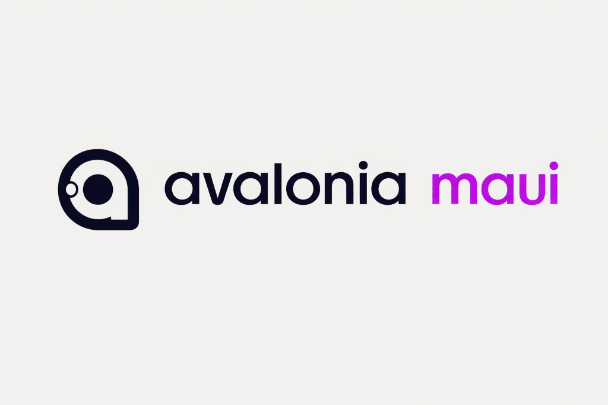

# Avalonia.Controls.Maui

This repository contains the Avalonia-based Handlers and target files for .NET MAUI. With this, you can replace its native controls with drawn controls from Avalonia. It also lets you deploy to platforms previously unavailable to .NET MAUI UI applications, such as Linux and WASM, as well as through different frameworks, like macOS AppKit.

For info on how to build the project, reference our [build docs](/docs/build.md).

## Projects

[Avalonia.Controls.Maui](/src/Avalonia.Controls.Maui/)

[Avalonia.Controls.Maui.Desktop](/src/Avalonia.Controls.Maui.Desktop/)

[Avalonia.Controls.Maui.SourceGenerators](/src/Avalonia.Controls.Maui.SourceGenerators/)

[Avalonia.Controls.Maui.Essentials](/src/Avalonia.Controls.Maui.Essentials/)

[Avalonia.Controls.Maui.SkiaSharp.Views](/src/Avalonia.Controls.Maui.SkiaSharp.Views/)

